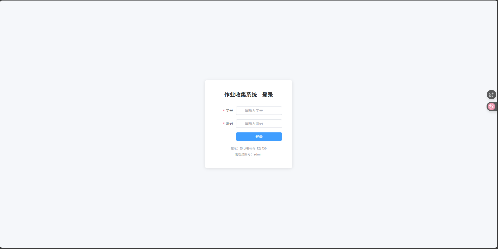
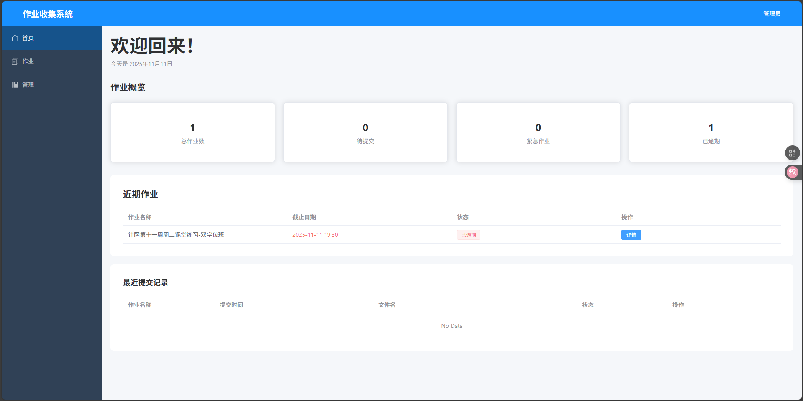
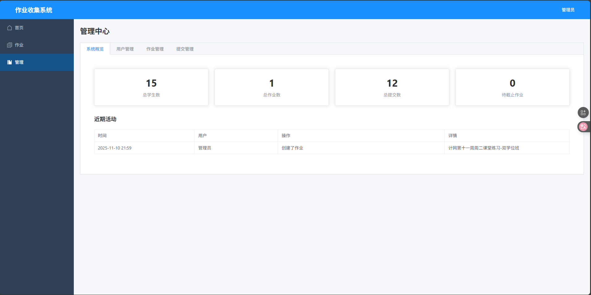
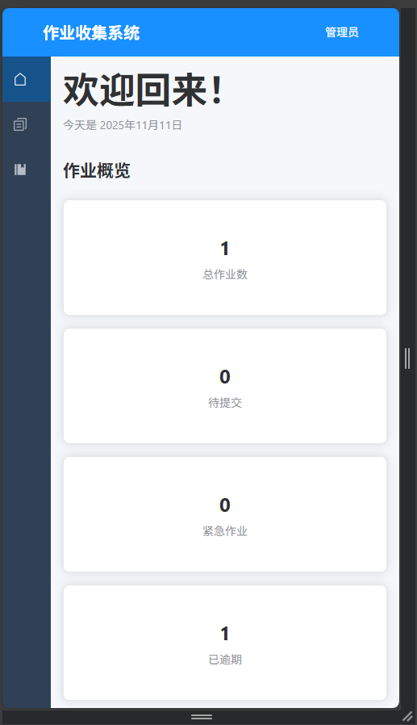
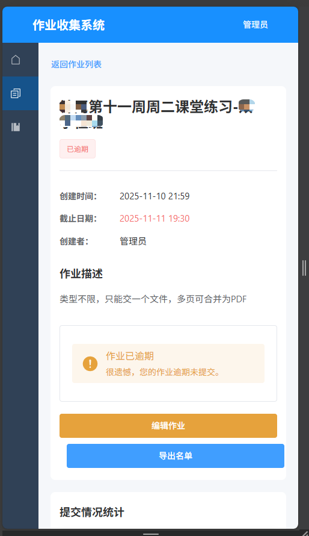

# Assignment Collection System

[中文](README_CN.md)

A web application system for teachers to collect and manage student assignments.
<div style="display: flex; flex-wrap: wrap; justify-content: space-between;">
    <div style="width: 65%; margin-bottom: 10px;">
        
        
        
    </div>
    <div style="width: 30%; margin-bottom: 10px;">
        
        
    </div>
</div>

## Project Structure

```
doc-collection/
├── client/              # Frontend Vue3 project
│   ├── src/             # Frontend source code
│   ├── public/          # Static resources
│   ├── package.json     # Frontend dependency configuration
│   └── vite.config.js   # Vite configuration file
├── server/              # Backend Express project
│   ├── controllers/     # Controllers
│   ├── routes/          # Routes
│   ├── middleware/      # Middleware
│   ├── data/            # Mock data
│   ├── index.js         # Server entry point
│   └── .env             # Environment variables configuration
├── uploads/             # File upload directory
└── README.md            # Project documentation
```

## Features

### Teacher Features
- **User Management**: View, add, edit, and delete student users
- **Assignment Management**: Create, edit, delete assignments, set deadlines and naming rules
- **Submission Management**: View all assignment submissions, download student assignments, delete submissions
- **Statistical Analysis**: View assignment submission status, filter out students who haven't submitted
- **File Management**: Support multiple file formats upload, automatically classify and store according to rules

### Student Features
- **View Assignments**: Browse all assignments, view detailed requirements
- **Submit Assignments**: Upload assignment files, ensure compliance with naming rules
- **Submission History**: View submitted assignment records, resubmit
- **Personal Information**: View personal information and assignment completion status

## Technology Stack

### Frontend
- Vue 3
- Vue Router 4
- Element Plus
- Axios
- Vite

### Backend
- Node.js
- Express
- Multer (file upload)
- xlsx (Excel parsing)
- node-schedule (scheduled tasks)

## Quick Start

### Prerequisites
- Node.js 14+ and npm 6+

### Method 1: Start Both Frontend and Backend Simultaneously (Recommended)

Execute the following commands in the project root directory to start both frontend development server and backend API server simultaneously:

```bash
# Ensure all dependencies are installed (first run)
npm install
cd client
npm install
cd ..

# Development environment (with hot reload)
npm run dev-all

# Production environment preview (using built files)
npm run start-all
```

### Method 2: Start Frontend and Backend Separately

#### Backend Installation and Running

1. Enter the server directory
```bash
cd server
```

2. Install dependencies
```bash
npm install
```

3. Start the server
```bash
# Development environment (using nodemon, supports hot reload)
npm run dev

# Production environment
npm start
```

The server will run at http://localhost:3001

#### Frontend Installation and Running

1. Enter the client directory
```bash
cd client
```

2. Install dependencies
```bash
npm install
```

3. Start the development server
```bash
npm run dev
```

The frontend will run at http://localhost:5173

## Production Environment Build

### Frontend Build

```bash
cd client
npm run build
```

The built files will be located in the `client/dist` directory

## Default Accounts

The system has preset the following accounts, all with the default password `123456`:

### Administrator Account
- Username: admin
- Password: 123456

### Student Accounts
- Username: 2023001
- Password: 123456

- Username: 2023002
- Password: 123456

- Username: 2023003
- Password: 123456

## Notes

1. Ensure the Excel file `名单.xls` is located in the project root directory, the system will automatically load student data from it
2. The system uses mock database, all data is stored in the `data` directory of the server
3. In development environment, frontend and backend run on different ports, cross-origin access is allowed through CORS configuration
4. Uploaded assignment files are saved in the `server/uploads` directory

## 文件类型限制与替换

- 作业的允许文件类型由 `assignments` 表的 `fileTypes` 字段定义，前端创建/编辑作业时可配置，上传与提交将按照该配置校验。
- 前端上传前会即时验证文件扩展名与大小（默认不超过 20MB），非法类型会提示并阻止上传。
- 后端上传接口会根据 `assignmentId` 读取 `fileTypes` 并再校验，非法类型将拒绝并删除已保存的文件，返回 `400 不支持的文件类型`。
- 当用户重新提交并替换已提交文件时，后端以事务原子化更新：
  - 更新提交记录为新文件
  - 删除旧文件，若删除失败将回滚并清理新文件，保证数据一致性与空间释放。

5. File upload size limit is 20MB, can be modified in the `.env` file
6. Supported file types include: pdf, doc, docx, xls, xlsx, ppt, pptx, zip, rar
7. File names must follow the specified rules, format: `{student_id}_{name}_{assignment_name}_{submission_date}`
8. Scheduled tasks are executed at 2:00 AM every Sunday by default, collection cycle can be modified in the `.env` file

## Project Configuration

All configuration items are set in the server's `.env` file:

- `PORT`: Server port
- `UPLOAD_DIR`: File upload directory
- `DB_PATH`: Database path
- `MAX_FILE_SIZE`: Maximum file size
- `FILE_NAMING_RULE`: File naming rule
- `COLLECTION_CYCLE`: Assignment collection cycle

## Future Optimization Directions

1. Implement real database storage
2. Add refined user permission management
3. Add assignment scoring function
4. Add assignment annotation and feedback functions
5. Improve statistics and analysis functions
6. Add email notification function
